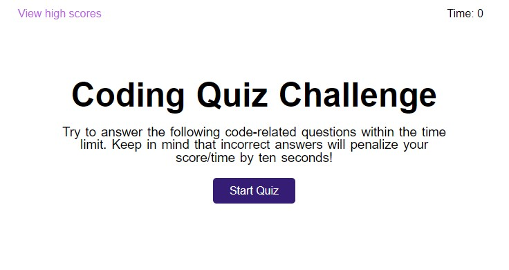

# 04-Module-Challenge
Web APIs Challenge: Code Quiz
___
## Code Quiz To Go

### [Code Quiz To Go](https://josejpd3.github.io/04-Module-Challenge/) is a short and effective way to brush up and test your coding knowledge.

___
Your score is based on how quickly and accurately you are able to answer each question.  
Every wrong answer will deduct 10 seconds from the timer.  
At the end of the quiz, the remaining time will be your score.  
You will then be prompted to enter your initials in order to save your score and place in the rankings.

## Begin by clicking [Start Quiz]